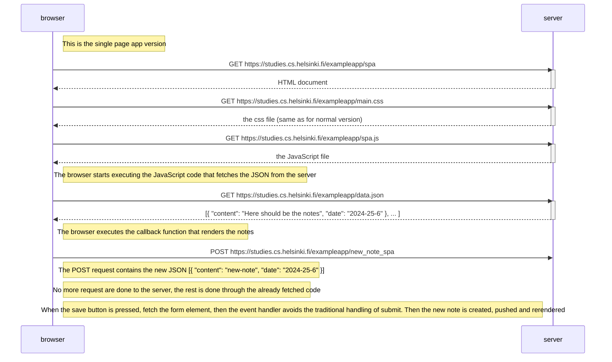

```mermaid
sequenceDiagram
    participant browser
    participant server

    Note right of browser: This is the single page app version 

    browser->>server: GET https://studies.cs.helsinki.fi/exampleapp/spa
    activate server
    server-->>browser: HTML document
    deactivate server

    browser->>server: GET https://studies.cs.helsinki.fi/exampleapp/main.css
    activate server
    server-->>browser: the css file (same as for normal version)
    deactivate server

    browser->>server: GET https://studies.cs.helsinki.fi/exampleapp/spa.js
    activate server
    server-->>browser: the JavaScript file
    deactivate server

    Note right of browser: The browser starts executing the JavaScript code that fetches the JSON from the server

    browser->>server: GET https://studies.cs.helsinki.fi/exampleapp/data.json
    activate server
    server-->>browser: [{ "content": "Here should be the notes", "date": "2024-25-6" }, ... ]
    deactivate server

    Note right of browser: The browser executes the callback function that renders the notes

    browser->>server: POST https://studies.cs.helsinki.fi/exampleapp/new_note_spa
    
    Note right of browser: The POST request contains the new JSON [{ "content": "new-note", "date": "2024-25-6" }]
    Note right of browser: No more request are done to the server, the rest is done through the already fetched code
    Note right of browser:  When the save button is pressed, fetch the form element, then the event handler avoids the traditional handling of submit. Then the new note is created, pushed and rerendered
    
```
