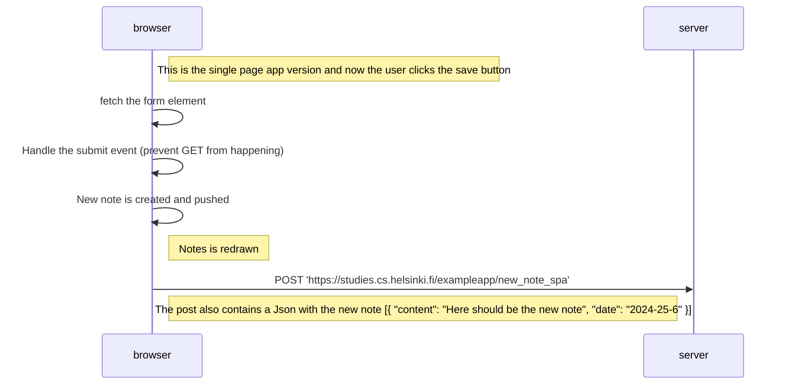

```mermaid
sequenceDiagram
    participant browser
    participant server

    Note right of browser: This is the single page app version and now the user clicks the save button 

    browser->>browser: fetch the form element
    browser->>browser: Handle the submit event (prevent GET from happening)
    browser->>browser: New note is created and pushed
    Note right of browser: Notes is redrawn
    browser->>server: POST 'https://studies.cs.helsinki.fi/exampleapp/new_note_spa'
    Note right of browser: The post also contains a Json with the new note [{ "content": "Here should be the new note", "date": "2024-25-6" }]
    
```
